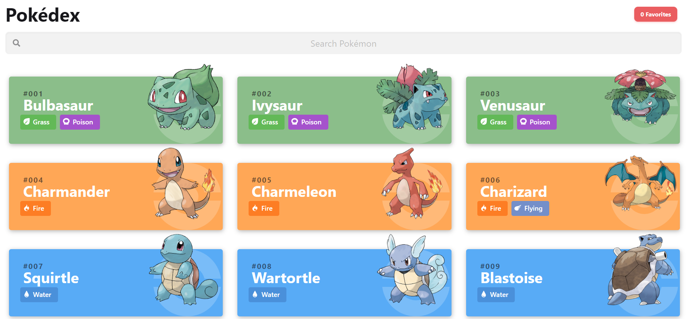

# Pokédex App

  

## 💻 About

You can check this project at:

This project was inspired by this [artist's visual app](https://www.behance.net/gallery/95727849/Pokdex-App) - [Figma](https://www.figma.com/file/THLxZSlOoUYMZrjFg0Kl1M/Pok%C3%A9dex?node-id=18241%3A2789)

The goal of this project was to use ReactJs to consume the following API https://pokeapi.co/ and to sharpen my knowledge of ReactJs.

### Features

- [x] **Pokémon listing**: List the pokémon using the REST API.

- [x] **Search Pokémon**: Method to filter the pokémons by their name.

- [ ] **Pokémon Individual Page**: Individual pokémon page contaning their stats, etc...

- [x] **Favorite Pokémon**: Section contain the user favorite pokémons using local storage.